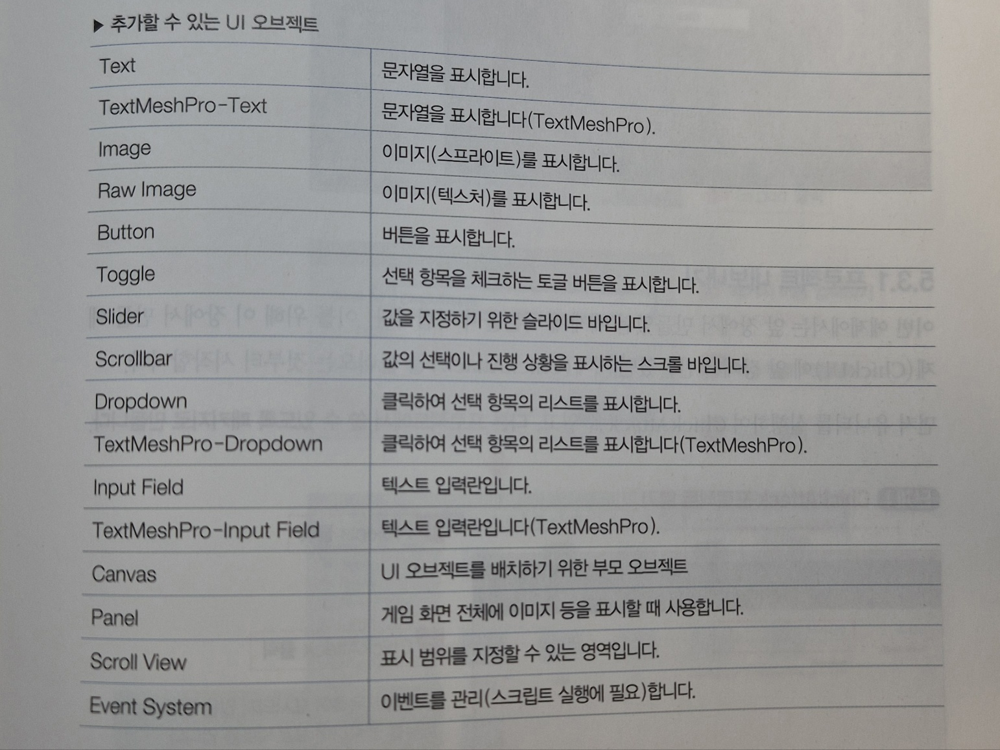
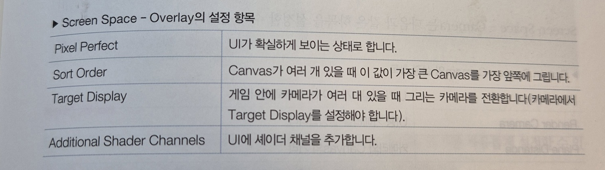
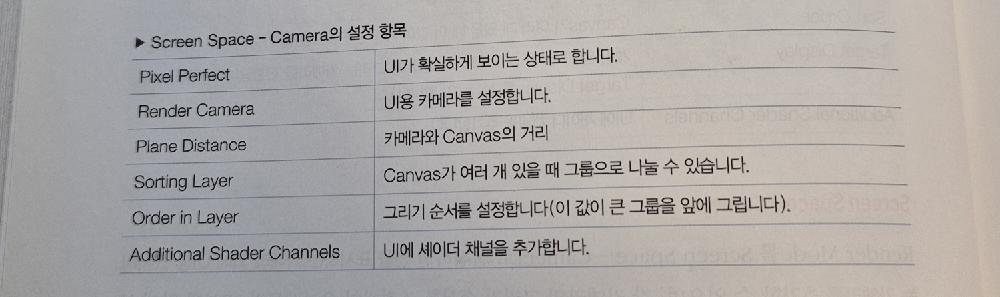
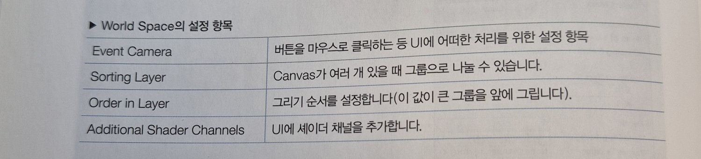

# 유니티
- 프로젝트 1개 = 게임 1개
- templete에서 2D, 3D 선택 가능
- 위쪽 |> 세모 버튼으로 게임 실행, 중지
- 오브젝트 위치 잃어버렸을 때 --> Hierarchy에서 오브젝트 더블클릭
- 코드(스크립트)는 vs code에서 작성  
: edit - preferences - external tools - external script editor - vs code

# 기능
## Hierarchy
- 오브젝트  
예시)  
MySquare  
-Circle  :MySquare의 구성요소 ex) mysquare의 팔    
  
- delete: 오브젝트 제거
- duplicate: 오브젝트 복사

## view
- scene view  
-- 게임 만드는 과정 볼 수 있음  
- game view  
-- 인게임 화면  
-- 배경색은 Main Camera 색 -->insepector - background에서 변경  
-- free aspect에서 화면 비율 설정 가능  
--> 모바일 게임에서 가로모드, 세로모드 설정 중요

## tools
- view tool: 화면 전체 이동
- move tool:  x, y, 자유 방향 이동
- rotate tool: x,y,z 방향 회전
- scale tool: x,,y,z 크기 조정
- rect tool: 자유 크기 조절
- transform tool: 모든 기능 합쳐짐  
--> 리셋: inspector - transform - 점 3개 - reset  
--> 컨트롤 제트도 가능

## inspector
:컴퍼넌트(오브젝트의 속성=옵션), 정보 표시, 값 변경
- transform: 모든 오브젝트 기본 속성
- sprite renderer: 사용자가 생성한 오브젝트 입맛대로 바꿀 수 있는 속성
- add component로 컴퍼넌트 추가
- remove component로 컴퍼넌트 제거  
ex) rigidbody 2D: 오브젝트에 물리법칙 적용

## project
:게임이 가지고 있는 파일들
### assets
:주로 scenes, scripts, sprites 폴더 생성  
- assets - create - folder : 새 폴더 생성  
-- 파일 탐색기에서 파일 붙여넣기 가능
- scripts(생성) 파일 - create - MonoBehaviour Script  
: 코드 일부 작성되어 있음  
또는  
scripts(생성) 파일 - create - scripting - empty c# script  
: 아예 빈 코드  
  
-->스크립트 더블클릭시 vscode로 넘어가서 수정 가능  
- vs code에서 수정, 저장하면 유니티에 반영 됨  
- vs code 옆쪽에 프로젝트 구조 보임

### console
- 스크립트 출력문, 로그, 에러 확인창

## 이미지 구하기
- 무료 이미지 제공 사이트  
character sprite site:opengameart.org 검색  
% site:opengameart.org --> %부분에 찾는 이미지 적으면 opengameart.org 사이트에서 검색 됨  
  
배경 만들기  
:sprites파일에 넣어둔 배경 이미지 hierarchy나 scene뷰에 끌어와 쓰기
  
크기조정
- shift누른채로 조절시, 비율 고정
- shift + alt 시 중앙 고정
-inspector의 pixels per unit 조정
(여기서 unit은 scene뷰의 작은 네모 하나)  
** inspector의 position 값도 unit 단위 (x값: 10 = unit 10칸)  
** 위치는 중앙 기준 (x값:10 = 중앙으로부터 10 떨어진 객체의 중앙)
  
움직이는 배경 만들기
- 같은 배경 붙이기 -> 같이 이동 -> 한개 위로 올리기 -> 반복 (컨베이너 벨트)
- b1, b2에 같은 코드 넣기 --> 한쪽 코드라도 수정시 모든 코드 바뀜  
  

(레이어 관련)
- order in layer: 레이어 순서 결정값(inspector에 있음)
- sorting layer: 그룹 묶기  
  
(스프라이트와 오브젝트 관계)
- 스프라이트 != 오브젝트  
--> 오브젝트에 스프라이트 설정하는 것  
  
(부모-자식 관계)
- 부모-자식 관계 등록시  
--> 자식의 위치는 부모 오브젝트와의 상대적 위치(거리)로 표시됨
- 부모 이동시 자식 함께 이동
--> 이동시 자식은 상대적 위치이므로 좌표 변경 x  
- 자식 이동시 부모 이동 x  
  
(collider)
- polygon collider: 오브젝터 모양 맞춰 충돌 판정 생성  
--> 일반 콜라이더보다 부담 큼. 너무 많이 사용 x  
  
## 함수
- start 함수: 게임 실행시 맨 처음 단 한번만 실행 --> 게임 설정
- update 함수: 게임 실행 후 매 프레임마다 반복 실행 --> 반복 기능
- 오브젝트에 어태치시 선언한 변수 컴포넌트에 등록됨 (수정 가능) **  
  
## 프리팹
- 하이어라키 창에서 프로젝트 창으로 끌어들이면 생성 가능
- 프리팹으로 생성한 오브젝트를 인스턴스라 함
- 프리팹은 하이어라키 창에 없어도 스크립트로 생성 가능  
--> 유지보수 좋다
- 프리팹 변경시 모든 인스턴스 변경됨 (프리팹 모드에서)
- 인스턴스 변경시는 개별 인스턴스만 변경됨 (하이어라키 창에서)  
--> overrides 시에는 개별 인스턴스 변경이 프리팹에 반영o
  
## UI
:유저 인터페이스  
- 화면에 표시할 메시지나 버튼 등

### 주요 UI 오브젝트
1. text
- 점수 표시로 주로 사용
- TextMesh Pro(TMP) :text보다 상위 오브젝트 --> 확대시 깔끔, 문자에 빛 비추기 등 표현 가능

2. Image
- Raw Image :텍스처 이미지 표시

3. Button
- 클릭시 지정한 함수 호출 가능
- 게임 시작 버튼으로 주로 사용
- Text를 자식 오브젝트로 가짐
- 이미지 활용해 다양한 모양 버튼 생성 가능  

4. 그 외

#### 컴포넌트
- Normal Color :아무 상호작용 없는 평상시 상태
- Highlighted Color :마우스를 올렸을때 색상
- Pressed Color :클릭 했을때 색상
- Disable Color :비활성 상태 색상  
  
- Transition -Sprite Swap :사용자 입력에 따라 버튼 이미지 변경  

### canvas  
- UI 오브젝트 배치하는 영역
- 크기는 게임뷰에 비례
- 2D, 3D 구분없이 사용
- 카메라, 빛의 영향 받지 않음
- 씬 뷰에서 크게 표시됨 --> 크게 표시된 캔버스 왼쪽 아래에 게임화면 표시됨
- 같은 canvas에서 여러 UI가 있는 경우, 하이어라키 창에서 아래쪽일 수록 앞에 배치  
ex) canvas  
     -button  
     -text  
--> text가 맨앞, button이 그 뒤에 표시됨

- 모든 UI 오브젝트는 canvas의 자식
- UI 오브젝트가 자식을 가질시, 그 오브젝트가 자식의 캔버스 역할을 함  

#### --컴포넌트--
- Render Mode :canvas 컴포넌트
--> Screen Space -overlay :UI가 가장 앞쪽에 표시됨  

--> Screen Space -Camera :씬 표시 카메라 외에 UI 표시 카메라 추가 가능 --> 각 카메라 순서 조절하여 오브젝트가 UI 앞에 오기 가능

--> World Space :canvas 위치, 크기 자유롭게 설정 가능 --> 이름, 체력바 등 활용  
  

- UI Scale Mode :UI 오브젝트 크기 조절  
--> Constant Pixel Size :픽셀 크기로 지정  
--> Scale With Screen Size :스크린 크기에 맞춰 조절  
--> Constant Physical Size :실제 물리적 크기로 조절  

- Rect Transform  
--> 다른 오브젝트의 transform과 같은 것  
--> scale은 width와 height의 비율  
  
- Anchor :canvas 위치 고정 (기준점)  
--> stretch모드 :앵커를 상하좌우로 나누어 배치 =앵커 여러개 배치 가능 /but, UI 깨질 위험 큼  
- Pivot :UI 오브젝트의 기준되는 점  
  
### EventSystem
: UI와 관련된 인풋 관리 오브젝트
- UI 관련 스크립트 처리
- 절대 제거x --> 제거시 눌러도 반응x

